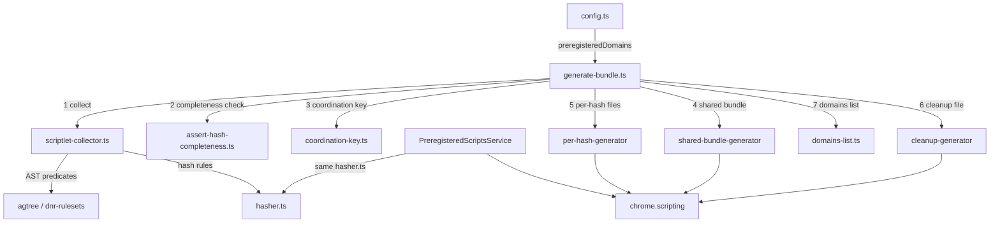

# Preregistered Scripts

Build tool that produces pre-compiled JavaScript bundles for domains where
ad-blocking rules must run before the page's own scripts (e.g. `youtube.com`).
Bundles are injected at `document_start` via MV3's
`chrome.scripting.registerContentScripts` and persist across browser sessions.

## Architecture



Build-time (this folder) and runtime
(`@adguard/tswebextension`'s `PreregisteredScriptsService`) both import the
**same** `hasher.ts` from `@adguard/tswebextension/mv3/preregistered-scripts`
to compute rule hashes. This shared contract is what lets the runtime map
"cosmetic rules the engine returns for a domain" to "which `{hash}.js` files
to register", without ever transmitting rule content at runtime — only
hashes.

## Pipeline

`generate-bundle.ts` runs the following steps per MV3 browser target:

| Step | Function | Purpose |
|------|----------|---------|
| 1. Collect | `ScriptletCollector.collect()` (`scriptlet-collector.ts`) | Walk all DNR rulesets, extract JS/scriptlet rules targeting preregistered domains, dedup by hash |
| 2. Completeness check | `assertHashCompleteness()` (`assert-hash-completeness.ts`) | Independently re-derive, using the real `@adguard/tsurlfilter` `Engine`, which hashes are reachable per domain, and fail the build if any of them wasn't collected in step 1 |
| 3. Coordination key | `generateCoordinationKey()` (`code-generators/coordination-key.ts`) | Generate a random per-build identifier shared by the shared bundle, per-hash files, and the cleanup file |
| 4. Shared bundle | `writeSharedBundle` (`code-generators/shared-bundle-generator/`) | Compile `scriptlets-bundle.js` — every unique scriptlet function used, deduplicated |
| 5. Per-hash files | `writePerHashFiles` (`code-generators/per-hash-generator/`) | Compile one `{hash}.js` per unique rule (scriptlet invocation or JS rule body) |
| 6. Cleanup file | `writeCleanupFile` (`code-generators/cleanup-generator/`) | Compile `cleanup.js`, which reassigns the coordination binding to `undefined` before any page script can run |
| 7. Domains list | `writeDomainsList` (`code-generators/domains-list.ts`) | Write `domains.js` — the list of domains that have at least one collected rule |
| 8. Atomic swap | `generatePreregisteredDomainBundles` (`generate-bundle.ts`) | Write everything to a temp dir, then `fs.rename` it over the old output dir, so a failure never leaves partially-written output in place |

`ScriptletCollector` does **not** resolve filter enable/disable, allowlist, or
user-rule state at build time — it only records which domains/rules exist in
the local filters. Exceptions (`#@#`/`#@%#`) and all other engine-side
resolution are handled at runtime by `PreregisteredScriptsService`, which
queries the live engine (`getCosmeticResult`) per domain.

`isRuleTargetsDomain` (used by step 1) mirrors the engine's own domain-list
semantics: a domain list made up **only** of exception entries (e.g.
`~a.com,~b.com##...`) applies globally except on the listed domains, exactly
like a fully generic rule minus the exclusions — it is *not* treated as
"matches nothing". Step 2 exists specifically to catch future regressions
of this kind before they reach production: if the build-time predicate ever
diverges from the engine's real matching again, the build fails instead of
silently shipping a domain registration that references a missing
`{hash}.js` file (which Chrome rejects at runtime).

## Generated bundle structure

Each domain's registration loads three kinds of files, always in this order:
`scriptlets-bundle.js` → its `{hash}.js` files → `cleanup.js` (see
`PreregisteredScriptsService.buildDomainScripts`). All of them coordinate
through a single random top-level `let` variable, generated once per build
(`coordination-key.ts`) — never a fixed name like `_ag`. See
[Why a random coordination key + cleanup file](#why-a-random-coordination-key--cleanup-file).

### `scriptlets-bundle.js`

Declares `let <coordinationKey> = (...)` at the top level (not inside any
wrapping IIFE, not a `window` property) — a lexical binding, invisible to
`Object.keys`/`getOwnPropertyNames`/`for...in`. Other classic scripts in the
same realm (per-hash files, `cleanup.js`) reference the bare identifier
directly (standard JS semantics for scripts sharing one realm).

- `.r(name, source, args, key)` — run a scriptlet, deduped by `key`.
- `.b` — `Set` used for dedup, shared with JS rule guards.

No double-injection guard needed: `registerContentScripts` injects each
file once per document; redeclaring the `let` would throw `SyntaxError`
anyway if it somehow ran twice.

### `{hash}.js`

One file per unique rule, named after its SHA-256 hash (see `hasher.ts`):

- Scriptlet rules: `<coordinationKey>.r("name", {...source}, [...args], "hash")`.
- JS injection rules: rule body wrapped in a dedup guard against
  `<coordinationKey>.b` (see `js-rule-guard-template.js`).

### `cleanup.js`

`<coordinationKey> = undefined;` in a try/catch — reassigns the bundle's
`let` (lexical bindings can't be `delete`d). Always the last entry in a
domain's `js` array; `document_start` guarantees it runs before any page
script, so `typeof <name>` is already `'undefined'` by the time the page
runs, indistinguishable from never having existed — even if the page knows
the exact identifier.

### Why a random coordination key + cleanup file

A fixed global like `window._ag` would let any page detect the extension,
read `.b` to see which rule hashes fired, and call `.r(...)` directly with
attacker-controlled args. Randomizing the name alone isn't enough against an
attacker who extracts the literal identifier from a published build. Using
a lexical `let` (not a `window` property) closes enumeration; reassigning it
to `undefined` in cleanup (instead of `delete`, which `let` doesn't support)
closes the remaining "does it still exist" signal, since `typeof` can't tell
"declared and `undefined`" apart from "never declared".

### `domains.js`

```typescript
export const preregisteredDomains = ["youtube.com", "m.youtube.com", ...];
```

## Files

| File | Purpose |
|------|---------|
| `config.ts` | `preregisteredDomains` — domains to generate bundles for. Add a domain here to register it. |
| `constants.ts` | `DOMAINS_LIST_FILENAME` and `minifyJs` (shared Terser options) |
| `generate-bundle.ts` | Orchestrator — runs collect → completeness check → coordination key → shared bundle → per-hash files → cleanup file → domains list |
| `scriptlet-collector.ts` | AST predicates (`isGenericCosmeticRule`, `isScriptletRule`, `isRuleTargetsDomain`, `extractScriptletNameAndArgs`) + the `ScriptletCollector` class |
| `assert-hash-completeness.ts` | `assertHashCompleteness` — cross-validates collected hashes against a real `@adguard/tsurlfilter` `Engine` instance |
| `code-generators/coordination-key.ts` | `generateCoordinationKey` — random per-build top-level `let` identifier |
| `code-generators/shared-bundle-generator/` | `shared-bundle-template.js` (runtime template) + `shared-bundle-generator.ts` (compiler) |
| `code-generators/per-hash-generator/` | `js-rule-guard-template.js` (runtime template) + `write-per-hash-files.ts` (compiler) |
| `code-generators/cleanup-generator/` | `cleanup-template.js` (runtime template) + `write-cleanup-file.ts` (compiler) |
| `code-generators/domains-list.ts` | `writeDomainsList` |
| `writeHelpers.ts` | `writeBundle` — validates JS syntax (`vm.Script`) and writes to disk |

The shared hash contract (`hashString`, `computeScriptletHash`,
`computeJsRuleHash`, `normalizeDomain`, `SHARED_BUNDLE_FILENAME`,
`CLEANUP_BUNDLE_FILENAME`, `PREREGISTERED_SCRIPTS_DIR`) lives in
`@adguard/tswebextension`
(`src/lib/mv3/background/preregistered-scripts/hasher.ts`), exported via the
`@adguard/tswebextension/mv3/preregistered-scripts` entry point — not in this
folder.

## Adding a new domain

1. Add the domain to `config.ts`:

   ```typescript
   export const preregisteredDomains: readonly string[] = [
       'youtube.com',
       'new-domain.com', // ← add here
   ];
   ```

2. Run `pnpm resources:mv3` to regenerate bundles.

3. Output appears in
   `Extension/filters/<browser>/preregistered-scripts/` for each MV3 browser
   target (e.g. `chromium-mv3`, `opera-mv3`).

## Runtime

At runtime, `@adguard/tswebextension` handles preregistered script
registration. The extension passes `preregisteredScriptDomains` and
`preregisteredScriptsPath` via the MV3 `Configuration` object;
`TsWebExtension.configure()` calls `PreregisteredScriptsService.sync()`,
which queries the engine per domain, computes rule hashes with the same
`hasher.ts`, and registers content scripts via
`chrome.scripting.registerContentScripts`. Each registration includes the
shared bundle, the per-hash files, and the cleanup file for that domain, in
that order:

```typescript
js: [
    'filters/preregistered-scripts/scriptlets-bundle.js',
    'filters/preregistered-scripts/{hash}.js',
    // ...one entry per unique rule hash active on this domain
    'filters/preregistered-scripts/cleanup.js',
]
```

`CosmeticApi` skips dynamic script/scriptlet injection for domains covered by
a successfully synced preregistered registration, avoiding double execution.
Filter enable/disable state, user rules, and allowlist entries are resolved
by the engine on every `configure()` call, so registrations stay in sync
without any additional build step.
