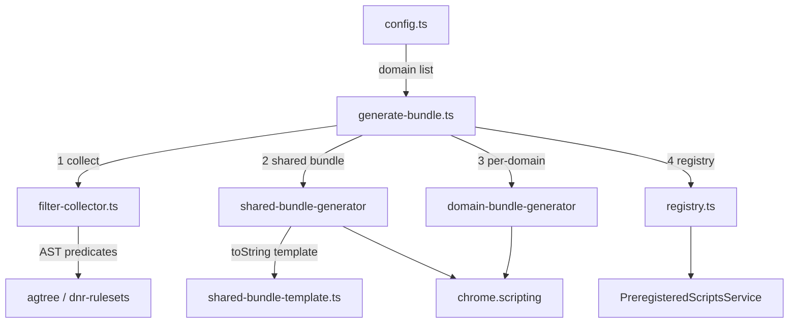

# Preregistered Scripts

Build tool that produces pre-compiled JavaScript bundles for domains where
ad-blocking rules must run before the page's own scripts (e.g. `youtube.com`).
Bundles are injected at `document_start` via MV3's
`chrome.scripting.registerContentScripts` and persist across browser sessions.

## Architecture



## Pipeline

Four steps, each in its own file:

| Step | File | Purpose |
|------|------|---------|
| 1. Collect | `filter-collector.ts` | Walk all DNR rulesets, extract JS rules & scriptlets, group by (domain, filterId) |
| 2. Shared bundle | `shared-bundle-generator/` | Compile `scriptlets-bundle.js` — all scriptlet functions deduplicated, loaded once per page |
| 3. Per-domain | `domain-bundle-generator/` | Compile `{domain}-{filterId}.js` — JS rule invocations + `_g.r()` calls |
| 4. Registry | `registry.ts` | Build `registry.js` mapping domains to filter ID arrays |

### Data flow

```
Filter lists (DNR rulesets)
    │
    ▼
FilterCollector.collect()
    │
    ├── domainRules        → domain-bundle-generator
    ├── domainScriptlets   → domain-bundle-generator
    └── scriptletNames     → shared-bundle-generator
                                 │
                                 ▼
                          scriptlets-bundle.js (one file, ~600 KB)
                          youtube.com-2.js     (tiny,  ~25 KB)
                          registry.js
```

## Generated bundle structure

### `scriptlets-bundle.js`

An IIFE loaded once per page. Defines the `window._g` API:

- `_g.r(name, source, args, key)` — run a scriptlet with deduplication
- `_g.b` — `Set` for JS rule idempotency (reused by per-domain bundles)
- `_g.c` — private placeholder object
- `_g._loaded` — guard against double-load when multiple registrations fire

### `{domain}-{filterId}.js`

Per-domain IIFE that references `_g` from the shared bundle:

```javascript
(function () {
    var _g = window._g; if (!_g) return;
    // JS rules with _g.b dedup guards
    try { var _k = "hash"; if (_g.b.has(_k)) return; _g.b.add(_k); /* rule body */ } catch(_e) {}
    // Scriptlet invocations
    _g.r("abort-on-property-read", {name, args, ...}, ["prop"], "hash");
})();
```

## Files

| File | Purpose |
|------|---------|
| `config.ts` | Domain list (string array). Add a domain here to register it. |
| `constants.ts` | Output filenames (`SHARED_BUNDLE_FILENAME`, `REGISTRY_FILENAME`) and `getBundleFileName` |
| `generate-bundle.ts` | Orchestrator — calls collect, shared, per-domain, registry in order |
| `filter-collector.ts` | Predicates (`isGenericCosmeticRule`, `isScriptletRule`, `isRuleTargetsDomain`, `extractScriptletNameAndArgs`) + `FilterCollector` class |
| `shared-bundle-generator/` | Template (`shared-bundle-template.ts`) + compiler (`shared-bundle-generator.ts`) |
| `domain-bundle-generator/` | Per-domain bundle compiler (`compileDomainBundle`) + writer (`writeDomainBundles`, `mergeDomainIds`) |
| `registry.ts` | `buildRegistry` + `writeRegistry` |
| `writeHelpers.ts` | `validateSyntax` (via `vm.Script`) + `writeBundle` |

## Adding a new domain

1. Add the domain to `config.ts`:

   ```typescript
   const config: string[] = [
       'drive2.ru',
       'youtube.com',
       'new-domain.com',   // ← add here
   ];
   ```

2. Run `pnpm resources:mv3` to regenerate bundles.

3. Output appears in:
   - `Extension/filters/chromium-mv3/preregistered-scripts/`
   - `Extension/filters/opera-mv3/preregistered-scripts/`

## Build integration

Bundles are generated as part of `pnpm resources:mv3`:

```bash
pnpm resources:mv3
```

To regenerate only preregistered bundles without downloading filters, run
`pnpm resources:mv3` after ensuring the filter files are already present locally.

## Runtime

At runtime, `@adguard/tswebextension` handles preregistered script
registration. The extension passes `preregisteredScriptDomains` and
`preregisteredScriptsPath` via the MV3 `Configuration` object, and
`TsWebExtension.configure()` calls `PreregisteredScriptsService.sync()`
which queries the engine per domain and registers content scripts via
`chrome.scripting.registerContentScripts`. Each registration includes
both the shared bundle and the per-hash files:

```typescript
js: [
    'filters/preregistered-scripts/scriptlets-bundle.js',
    `filters/preregistered-scripts/${hash}.js`,
]
```

Enabled/disabled filters are synced automatically —
`PreregisteredScriptsService.sync()` queries the engine for current
cosmetic rules on every `configure()` call.
