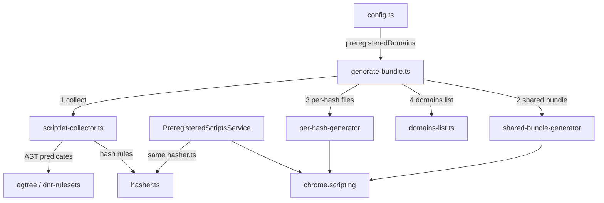

# Preregistered Scripts

Build tool that produces pre-compiled JavaScript bundles for domains where
ad-blocking rules must run before the page's own scripts (e.g. `youtube.com`).
Bundles are injected at `document_start` via MV3's
`chrome.scripting.registerContentScripts` and persist across browser sessions.

## Architecture



Build-time (this folder) and runtime
(`@adguard/tswebextension`'s `PreregisteredScriptsService`) both import the
**same** `hasher.ts` from `@adguard/tswebextension/mv3/preregistered-scripts`
to compute rule hashes. This shared contract is what lets the runtime map
"cosmetic rules the engine returns for a domain" to "which `{hash}.js` files
to register", without ever transmitting rule content at runtime — only
hashes.

## Pipeline

`generate-bundle.ts` runs 4 steps per MV3 browser target:

| Step | Function | Purpose |
|------|----------|---------|
| 1. Collect | `ScriptletCollector.collect()` (`scriptlet-collector.ts`) | Walk all DNR rulesets, extract JS/scriptlet rules targeting preregistered domains, dedup by hash |
| 2. Shared bundle | `writeSharedBundle` (`code-generators/shared-bundle-generator/`) | Compile `scriptlets-bundle.js` — every unique scriptlet function used, deduplicated |
| 3. Per-hash files | `writePerHashFiles` (`code-generators/per-hash-generator/`) | Compile one `{hash}.js` per unique rule (scriptlet invocation or JS rule body) |
| 4. Domains list | `writeDomainsList` (`code-generators/domains-list.ts`) | Write `domains.js` — the list of domains that have at least one collected rule |

`ScriptletCollector` does **not** resolve filter enable/disable, allowlist, or
user-rule state at build time — it only records which domains/rules exist in
the local filters. Exceptions (`#@#`/`#@%#`) and all other engine-side
resolution are handled at runtime by `PreregisteredScriptsService`, which
queries the live engine (`getCosmeticResult`) per domain.

## Generated bundle structure

### `scriptlets-bundle.js`

An IIFE loaded once per page (guard: `if (window._ag) return`). Defines the
`window._ag` API:

- `_ag.r(name, source, args, key)` — run a scriptlet with dedup by `key`.
- `_ag.b` — `Set` used for dedup, shared with JS rule guards.

### `{hash}.js`

One file per unique rule, named after its SHA-256 hash (see `hasher.ts`):

- Scriptlet rules: `_ag.r("name", {...source}, [...args], "hash")`.
- JS injection rules: rule body wrapped in a dedup guard against `_ag.b`
  (see `js-rule-guard-template.js`).

### `domains.js`

```typescript
export const preregisteredDomains = ["youtube.com", "m.youtube.com", ...];
```

## Files

| File | Purpose |
|------|---------|
| `config.ts` | `preregisteredDomains` — domains to generate bundles for. Add a domain here to register it. |
| `constants.ts` | `DOMAINS_LIST_FILENAME` and `minifyJs` (shared Terser options) |
| `generate-bundle.ts` | Orchestrator — runs collect → shared bundle → per-hash files → domains list |
| `scriptlet-collector.ts` | AST predicates (`isGenericCosmeticRule`, `isScriptletRule`, `isRuleTargetsDomain`, `extractScriptletNameAndArgs`) + the `ScriptletCollector` class |
| `code-generators/shared-bundle-generator/` | `shared-bundle-template.js` (runtime template) + `shared-bundle-generator.ts` (compiler) |
| `code-generators/per-hash-generator/` | `js-rule-guard-template.js` (runtime template) + `write-per-hash-files.ts` (compiler) |
| `code-generators/domains-list.ts` | `writeDomainsList` |
| `writeHelpers.ts` | `writeBundle` — validates JS syntax (`vm.Script`) and writes to disk |

The shared hash contract (`hashString`, `computeScriptletHash`,
`computeJsRuleHash`, `normalizeDomain`, `SHARED_BUNDLE_FILENAME`,
`PREREGISTERED_SCRIPTS_DIR`) lives in `@adguard/tswebextension`
(`src/lib/mv3/background/preregistered-scripts/hasher.ts`), exported via the
`@adguard/tswebextension/mv3/preregistered-scripts` entry point — not in this
folder.

## Adding a new domain

1. Add the domain to `config.ts`:

   ```typescript
   export const preregisteredDomains: readonly string[] = [
       'youtube.com',
       'new-domain.com', // ← add here
   ];
   ```

2. Run `pnpm resources:mv3` to regenerate bundles.

3. Output appears in
   `Extension/filters/<browser>/preregistered-scripts/` for each MV3 browser
   target (e.g. `chrome-mv3`, `opera-mv3`).

## Runtime

At runtime, `@adguard/tswebextension` handles preregistered script
registration. The extension passes `preregisteredScriptDomains` and
`preregisteredScriptsPath` via the MV3 `Configuration` object;
`TsWebExtension.configure()` calls `PreregisteredScriptsService.sync()`,
which queries the engine per domain, computes rule hashes with the same
`hasher.ts`, and registers content scripts via
`chrome.scripting.registerContentScripts`. Each registration includes both
the shared bundle and the per-hash files for that domain:

```typescript
js: [
    'filters/preregistered-scripts/scriptlets-bundle.js',
    'filters/preregistered-scripts/{hash}.js',
    // ...one entry per unique rule hash active on this domain
]
```

`CosmeticApi` skips dynamic script/scriptlet injection for domains covered by
a successfully synced preregistered registration, avoiding double execution.
Filter enable/disable state, user rules, and allowlist entries are resolved
by the engine on every `configure()` call, so registrations stay in sync
without any additional build step.
